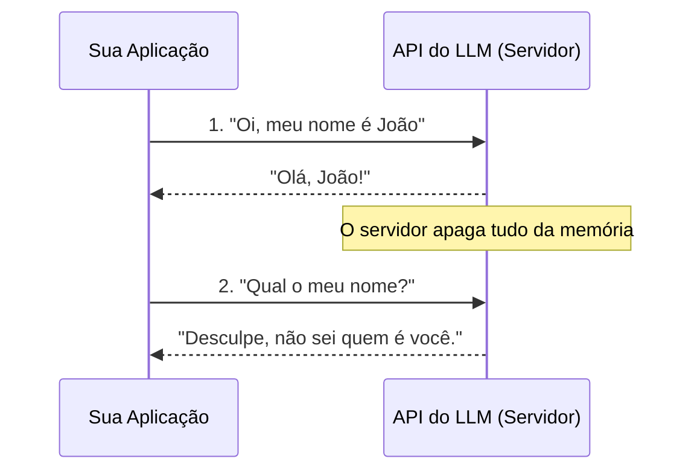
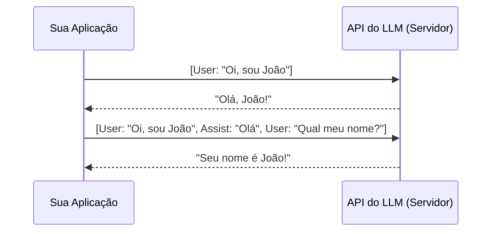

# Arquitetura de Sistemas reais com IA

---

## Muito Prazer! Quem sou eu?

**Pedro Matumoto (ou só Matumoto mesmo)**
* Engenheiro de Computação recém-formado pelo Instituto Mauá de Tecnologia com minor de Bioengenharia
* **Background:** Fiz parte da Mauá JR, Kimauanisso, dei monitoria de projetos também! Pra fechar, fiz um TCC sobre robótica autônoma doméstica.
* Hoje em dia trabalho com engenharia de software e IA de grandes quantidades de dados, mas sou apaixonado por robótica.
* **Foco atual:** Arquitetura de Software, Inteligência Artificial e Machine Learning.
  
<figure style="text-align: center;">
    
</figure>

---

## Onde estamos e para onde vamos?

**O cenário atual**

**O problema:**
Usar a interface web é fácil. Mas para poder utilizar em **sistemas reais** isso não basta. Como nós pegamos essa tecnologia e  que nós construímos? Como um sistema corporativo usa IA sem expor dados e sem custar uma fortuna?

**O objetivo do curso:**
1. Tirar a "magia" da Inteligência Artificial.
2. Entender os limites técnicos das APIs de LLM.
3. Aprender a arquitetar sistemas reais ao redor desses modelos.

---

## Agenda da Aula de hoje

1. O que acontece "por baixo dos panos" de um LLM?
2. A Ilusão da Memória: O paradigma *Stateless*
3. O que é Contexto e por que ele custa caro?
4. Estratégias de Arquitetura para manter o Contexto
5. RAG (Retrieval-Augmented Generation) na Prática
6. Dúvidas e Discussão

---

## 1. Como um LLM enxerga o mundo?

* LLMs (Large Language Models) são, na sua essência, motores de probabilidade.
* Eles recebem um texto (Prompt) e preveem a próxima palavra (Token).
* **O segredo:** Para o modelo, o universo inteiro nasce e morre a cada requisição.

---

## 2. O Paradigma Stateless (Sem Estado)

Assim como o protocolo HTTP original, as APIs de LLM são **Stateless**.

* **O que isso significa?** A requisição 2 não sabe absolutamente nada sobre a requisição 1.
* Não existe "memória" nativa no servidor do modelo.
* Cada chamada à API deve conter **toda** a informação necessária para a resposta.

---

## 3. Arquitetura Puramente Stateless

**Vantagens:**
* Altamente escalável (fácil balanceamento de carga).
* Menor uso de recursos no servidor.
* Previsibilidade: a mesma entrada tende a gerar saídas muito similares.

**Desvantagens:**
* Impossível manter uma conversa contínua sem intervenção.
* "Zero awareness" do que foi feito um segundo atrás.

---

## 4. A Ilusão da Memória: Entra o Contexto

Se o modelo não tem memória, como o ChatGPT lembra do meu nome?

* **A resposta:** A interface do usuário (o cliente ou o backend da sua aplicação) é quem gerencia o estado.
* Nós reenviamos o histórico da conversa a cada nova mensagem.

---
## Qual é o grande problema arquitetural de reenviar o histórico inteiro a cada mensagem?

---

## 5. O Custo do Contexto e a Janela de Tokens

* **Tokens:** A unidade de medida do LLM (aprox. 3/4 de uma palavra).
* **Janela de Contexto (Context Window):** O limite máximo de tokens que o modelo consegue processar de uma vez (ex: 8k, 128k, 1M, 2M).

**O Gargalo da Arquitetura:**
1. **Financeiro:** Você paga por token enviado (Input). Históricos longos = requisições caras.
2. **Latência:** Mais contexto = mais tempo de processamento.
3. **Atenção:** Modelos tendem a esquecer ou ignorar informações no "meio" de contextos gigantes (Lost in the Middle).

<figure style="text-align: center;">
  
  <figcaption style="text-align: center;">Fonte: <a href="https://miro.medium.com/1*QVXvydRMEWTWiUP42bYBAg.png">Medium</a></figcaption>
</figure>

---

## 6. Arquiteturas para Gestão de Contexto

Como arquitetos de software, não podemos apenas jogar texto infinito no modelo. Precisamos de estratégias:

1. **Sliding Window:** Manter apenas as últimas *N* mensagens.
2. **Summarization:** Usar o próprio LLM ou outras bibliotecas para resumir conversas antigas e guardar apenas o resumo.
3. **Arquitetura Baseada em RAG:** Buscar apenas o contexto relevante sob demanda.

---

## 7. A Arquitetura RAG (Retrieval-Augmented Generation)

A forma mais eficiente de dar "conhecimento" ao LLM sem estourar a janela de contexto.

1. **Recuperação (Retrieval):** O usuário faz uma pergunta. O sistema busca em um banco de dados (geralmente Vetorial) os documentos relevantes.
2. **Aumento (Augmentation):** O sistema junta a pergunta do usuário com os documentos encontrados.
3. **Geração (Generation):** O LLM lê esse pacote focado e responde.

<figure style="text-align: center;">
  
  <figcaption style="text-align: center;">Fonte: <a href="https://blog.langchain.com/content/images/2024/02/image-16.png">LangChain Blog</a></figcaption>
</figure>

---

## 8. Banco Vetorial vs. Banco Tradicional

Por que não usamos um banco de dados SQL normal para o RAG?

Pensando em uma biblioteca:

* Banco Relacional (SQL): Você chega no balcão e pede o título exato. Se errar uma letra, o sistema retorna vazio. O SQL é literal.

* Banco Vetorial: Você chega no balcão e diz: "Quero ler sobre andar no mato, natureza e mochilão". O bibliotecário entende a "vibe" do que você pediu e te traz os livros certos, mesmo que nenhuma daquelas palavras exatas esteja no título.

O Banco Vetorial busca por significado (semântica), não por palavras-chave.

---
## 9. Embeddings: Como o computador entende a "vibe"?

Para o computador fazer essa processo, precisamos transformar texto em números através de Embeddings.

Imagine um mapa. Cidades parecidas ficam na mesma vizinhança.

O Embedding pega uma frase e dá a ela uma "coordenada GPS" em um espaço matemático.

Ideias parecidas ficam fisicamente próximas umas das outras.

<figure style="text-align: center;">
  
  <figcaption style="text-align: center;">Fonte:  <a href="https://corpling.hypotheses.org/files/2018/04/Screen-Shot-2018-04-25-at-13.21.44.png">Around the word</a>
  </figcaption>
</figure>

---

## 10. Conclusão: O Papel do Engenheiro/Desenvolvedor

Trabalhar com LLMs não é só "fazer prompts legais". É projetar sistemas robustos:

* O LLM é apenas o motor de raciocínio lógico (o processador).
* A sua arquitetura é que deve fornecer a memória (RAM) e os arquivos (Disco).
* **Stateless** é a regra do modelo. O **Contexto** é a responsabilidade do sistema que você constrói ao redor dele.

---

## Dúvidas e Discussão Aberta

* Perguntas?
* Ideias de projetos que vocês gostariam de construir usando LLMs?

Obrigado pela atenção!
