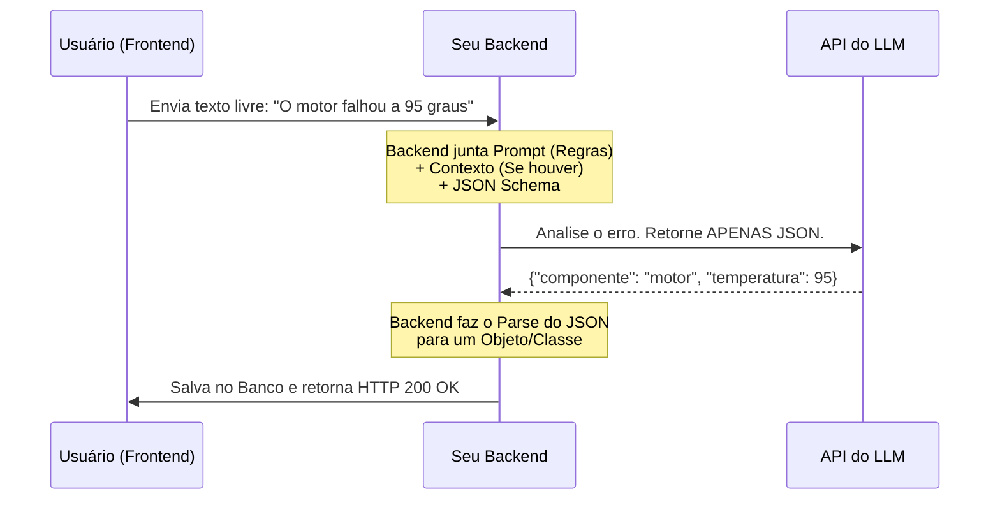

<div align="center">

# Engenharia de Prompt e Contexto para Devs
### Integração de LLMs e Extração de Dados (Structured JSON Outputs)

<br>

📱 **Material da Aula 2:**
`github.com/pedromatumoto/docs/aula02.md`

</div>

---

## Agenda da Aula

1. Recapitulação (Aula 1)
2. A Grande Confusão: Prompt vs. Contexto
3. O Problema da Linguagem Natural em Sistemas
4. Engenharia de Prompt: O jeito Dev (Restrições)
5. Structured Outputs: Forçando o formato JSON
6. Fluxo Prático: Do Texto Livre ao Objeto Tipado
7. Tratamento de Erros e Validação
8. Dúvidas e Discussão

---

## 1. Onde paramos na última aula?

* **LLMs são Stateless:** Eles não têm memória.
* **A nossa missão:** Construir a infraestrutura ao redor da API (como o RAG) para dar suporte à IA.
* **O gargalo de hoje:** Como eu garanto que a IA vai processar o texto e me devolver um formato de dados que o meu código consiga ler (como um JSON) sem quebrar o sistema?

---

## 2. A Grande Confusão: Prompt vs. Contexto
Chamamos qualquer texto enviado à IA de "Prompt". Misturar essas duas coisas gera sistemas frágeis.

**1. Engenharia de Prompt (Instrução):**
* É o "COMO" você quer a resposta.
* Define formato, restrições, persona e regras lógicas.
* Ex: *"Extraia as entidades do texto abaixo. Retorne APENAS um JSON válido. Não cumprimente."*

**2. Engenharia de Contexto (Dados/State):**
* É o "O QUÊ" a IA precisa analisar.
* São os fatos injetados pelo sistema (Histórico do usuário, busca no banco de dados, RAG).
* Ex: *"Aqui está o PDF do manual do motor da versão 2025."*

---

## 3. Separando as Responsabilidades

Por que separar? Porque o Prompt é estático (definido pelo desenvolvedor), enquanto o Contexto é dinâmico (gerado pelo usuário/sistema).

---

## 4. Engenharia de Prompt

Escrever bons prompts não é sobre criatividade ou "conversa". É sobre definição de restrições (Constraints).

* Zero Delírio Criativo: Use o System Prompt para travar a IA no papel de "Extrator de Dados".

* Definição de Esquema (Schema): Mostre as chaves e os tipos de dados esperados (ex: int, string, boolean).

* Few-Shot Prompting: Dê 1 ou 2 exemplos perfeitos de "Entrada -> Saída" no próprio prompt.

---

## 5. Structured Outputs (Saídas Estruturadas)

A solução definitiva da indústria: JSON Mode e Function Calling / Structured Outputs.

Em vez de implorar no prompt para a IA não errar a formatação, nós usamos a API (como a da OpenAI) para forçar o retorno em um esquema validado.

```
{
  "nome": "João",
  "idade": 25,
  "telemetria_anomala": false
}
```
O backend pega essa string JSON, faz a desserialização para uma classe em Python ou C#, e o sistema continua o fluxo.

---

## 6. Fluxo Prático: Do Texto Livre ao Objeto

Veja a arquitetura de uma aplicação rodando em produção com JSON forçado:


---

## 7. Tratamento de Erros e Validação

E se a IA alucinar e devolver idade: "vinte" (String) em vez de 20 (Int)?

O Fluxo Resiliente:

* Validação: Bibliotecas de tipagem (como o Pydantic no Python) para validar o JSON na hora que ele chega do LLM.

* Auto-Correção (Retry Logic): Se der erro de tipagem, o backend não devolve erro pro usuário. Ele pega a mensagem de erro do sistema (ex: 'TypeError: expected int, got str'), envia de volta pro LLM e pede: "Corrija seu JSON baseado neste erro".

---

## 9. Conclusão da Aula 2

Prompt vs Contexto: Você programa as regras no prompt e injeta dados no contexto.

Transforme linguagem natural em JSON, faça o parse para as suas classes, e o LLM se torna apenas mais uma parte no seu ecossistema.

Restrição de saídas!

---

## 10. Prática
Como vocês estruturariam o JSON de saída para extrair os dados de um currículo em PDF?

